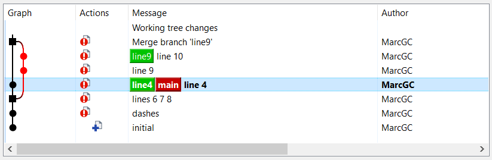
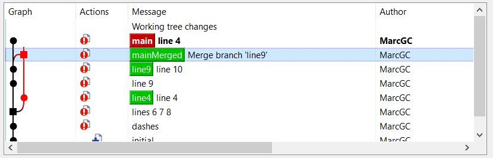
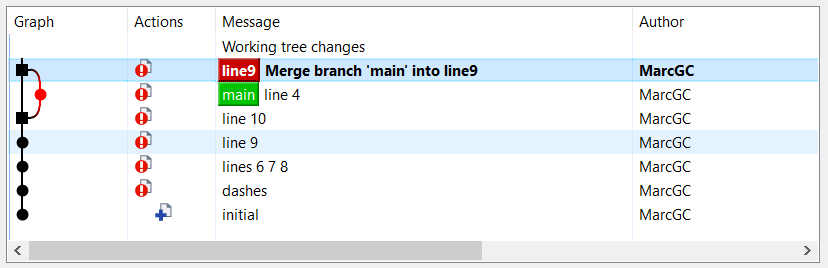

# get fit at git <!-- fit -->

<!-- _class: invert -->

### hands-on git beginners training

Marc Gonzalez-Carnicer `gomr@betterask.erni`


---

# what is git?


---

# introduction

### tell us about:

* your experience with git (and other VCSs)
* what you can do with git
* what you don't feel comfortable with
* your expectations for this training

---

### this training

* it's about getting fit at git
* some exercises are very easy
* will cover the very basics and fundamentals
* some contents and exercises may be skipped (depending on the participants previous knowledge)
* is very long with probably too much information, that you may do at home


---

# basic concepts
<!-- _class: invert -->


## (quick review)

---

## repository

Where everything is stored.

* normal: contains files & history
* bare: only the history

# distributed

* git is a distributed VCS
* clones (repository copies) contain all the history
* (unlike in a centralized VCS like svn)

---

# git log (history)

history is a graph: nodes + lines

* graph nodes : commits - are diffs / patch / deltas
* graph lines (between nodes) : define ancestry
* strictly speaking, the arrow sense in git means the parent, not the time or progress

---

# git graph

See the nodes, and arrows pointing to the parent node.


---

# patch / diff

Mathematically, a node (diff / delta / patch) is defined as:

`[ contents of commit2 ]` - `[ contents of commit1 ]`

`patch` and `diff` are the _conceptual base_ beneath git. They are linux commands since prehistoric times.


---

# branch

The most important concept in _modern_ VCSs.

The main reason why git was created is because in svn (the mainstream VCS at the time), the branching mechanism is poorly designed (although it was _good enough_ for that time).

---

# branching vs git branch

A _git branch_ does __not__ imply a _bifurcation_, as in a tree:


Humans tend to think of branches in a repository as the ones in a tree.

---

# branching vs git branch

A _git branch_ is a _reference_ that points to a commit.

In git, branching (bifurcation) is allowed thanks to _git branches_.


Here we see 3 _git branches_ and only 2 _bifurcations_.

---

# branching without branch

Branching happens without explicitly branching:

1. different users, same branch
1. different cloned repos (same user), same branch

---

# no branch no commit

Commits without a _git branch_ are deleted / lost.

Reminder: git was designed for being able to remove unused work.

---

# configure your git <!-- fit -->

<!-- _class: invert -->

### get ready to work with git

---

# download the tools

1. download and install kdiff3: https://download.kde.org/stable/kdiff3/

1. download and install tortoise git: https://tortoisegit.org/download/

1. with tortoise git, clone the _git helper tools repo_: https://github.com/carnicer/gitTools

---

## CLI or GUI?

* a minimum proficiency of the CLI (Command Line Interface) will always be necessary
* a hybrid method is best - choose depending on your preferences / GUI tool

---

# configure tortoise git

configure tortoise git bash (`vi ~/.bashrc`) with the git aliases and prompt. Edit `bashrc.bash`, leave only the `bash_aliases` and `git_aliases` entries.

- configure the diff tool: `C:\Program Files\KDiff3\kdiff3.exe`
- configure the merge tool: `C:\Program Files\KDiff3\kdiff3.exe %base %mine %theirs -o %merged`

---

# configure your (CLI) ID

Who are you?

* `git config [--global] user.name "your name"`
* `git config [--global] user.email your@email.com`

The optional `--global` option is for specifying which ID to configure: for that repo, or for all repos (default).

---

# configure the CLI

Configure the `git lol` __git-alias__ (see & copy from `git_aliases.sh`), your favorite CLI editor ...

* `git config --global --add alias.lol "log --graph --decorate --pretty=oneline --abbrev-commit --all"`
* set the `EDITOR` environment variable, like i.e.:`export EDITOR='vim -X'`
* if using linux, configure your `.bashrc` with alias files (like the ones provided in this training)


---

# master the log <!-- fit -->

<!-- _class: invert -->

---

# understand the log

Identify in graphs the nodes (commits), the connections, the parents and the children. Refer to previous slide with graph or to upcoming _exercise #1_.

Not using the log view with branches is like typing with half eye instead of 2. This feature is a bit hidden in github (_insights_ / _network_).

---

# git prompt

With the git prompt (unlike some GUIs), you can always know _where_ and _how_ you are:

- view your current branch name
- view your current operation status (are you clean?)


---

# GUI log

With _tortoise git_, have always open a _show log_ and a _check for modifications_ windows.

With the CLI, use `git lol` and its aliases (provided and suggested by this training)

---

## avoid HASH, use your HEAD

Each commit is identified by a _unique_ HASH (SHA-1), a computed hexadecimal number, like i.e. `9fe67124046504220c94924a459eeba00b009abd` (which may be abbreviated as `9fe6712`).

The HASH is computed from the commit diff, the author, date, and several other data.

---

### the HEAD

The `HEAD` refers to the currently _checked-out commit_.

* tip : refer to commits using relative `HEAD` positions, instead of HASH (hard to memorize and type)
* examples: `HEAD~6, HEAD~2, HEAD~1 (= HEAD~), HEAD^1, HEAD^2`

----

# exercise #1: log and diff
 <!-- fit -->
<!-- _class: invert -->

---

# exercise #1

Clone the demo repo:

https://github.com/ERNI-Academy/training-dumb-repo/

For this exercise, you can also clone or use your favorite git repo.


---

# GUI :

Using the GUI :

* identify the branches
* view commit diffs
* compare diffs between 2 commits
* view diffs between branches
* checkout to different branches

---

# CLI

Using the CLI:

* use `git log`
* use `git lol`
* use `git lol -9`
* use `git show` on a given commit

---

# diffs with the CLI

* view diffs between 2 commits, practice diff ref formats: `HEAD~2`, `..HEAD~2`, `..branch`, `branch2..commit1`, ...
* use also `git difftool` (complicated with _git bash for windows_)
* use `git diff --name-status` between 2 commits to see changed files
* checkout to different branches

---

# basic commands <!-- fit -->

<!-- _class: invert -->

---

# basic commands (1)

Is there any one you don't know?

* `git clone` (once per repo)
* `git init` (once per repo)
* `git checkout`
* `git branch`
* `git add`
* `git commit`
* `git status`


---

# basic commands (2)

Is there any one you don't know?

* `git show`
* `git diff`
* `git reset`
* `git merge`
* `git rebase`
* _fast-forward_ (both with `merge`/`rebase`)

---

# merge vs rebase

2 ways of integrating:

* merge : new _merge commit_
* rebase : moves commits to _new base_


---

## integration example<!-- fit -->

<!-- _class: invert -->


---

# integration example

Integration: process of bringing changes together.

In the following example the _git integration commands_ (`checkout`, `reset`, `merge`, `rebase` ...) are used.

In the exercise, you will have to replicate this example. __IMPORTANT__: You _don't have to remember_, but _understand_ instead.

---

### initial situation

* 3 branches: _main_ (`HEAD`), _line4_, _line9_
* 2 actual bifurcations


---

### hard reset

* checkout _main_ branch
* reset of _main_ branch __to__ _line4_ branch


---

### merge

_line9_ branch is merged __into__ _main_ branch


---

### go back with a reset

Now with rebase. First, let's get back to the previous situation.

* select branch _line4_
* reset (_main_ branch) __to__ _line4_ branch
* notice: the tool _remembers_ the branch-less merge




---

### rebase (with backup)

* add a _backup branch_ to avoid _forgetting_ the merge
* _main_ branch is rebased __onto__ _line9_ branch
* _line4_ branch is _not forgotten_ (it has a reference)




---

### compare the merge and rebase commits

* select on both commits (merge + rebase)
* click on _compare revisions_
* verify they are identical


---

### delete merge branch

Delete the _merge branch_ (not necessary).


---

### delete rebased old branch

Delete the already rebased _line4 branch_ (not necessary).


---

### fast-forward merge/rebase

Proper use of _fast forward_: checkout _line9_, merge/rebase with FF.


---

### force a no-ff (fast-forward) merge

Force a _no fast-forward_ merge with `--no-ff` (checkbox).



---

# exercise #2<!-- fit -->
<!-- _class: invert -->

# integration commands <!-- fit -->

---

# exercise #2: integration commands

Replicate the examples in the previous section :

* with tortoise git
* with the CLI


---


# best practices, tips #1
<!-- _class: invert -->

# stash is your friend <!-- fit -->

---

# the stash

The _stash_ (or _index_) are the changes that are marked (_staged_) for committing.

This means you can _play_ with which subset of your current changes you want to commit, for a nicer and more meaningful history.

---


---

# partial commits

Select _hunks_ (partial commits) with either:

* diff viewer, then click _merge_
* `git add --patch` / restore after commit / editor
* `git add <file>` instead of `git add -uno`

---
# unstaging

For _unstaging_ (remove from index/stash), you can either :

- `git restore <file> # modern style`
- `git checkout -- <file> # old style`

NOTE: _tortoise git_ eliminates the stash (considers modified files as staged without an explicit add)

Question for linux fans: Notice the awkward syntax above. What does the '--' stand for?)`

---

# exercise #3<!-- fit -->
<!-- _class: invert -->

# stashing / partial add  <!-- fit -->

---

# exercise #3

With a diff viewer (kdiff3), select (_cherry pick_) the changes to commit and the changes to discard :

1. edit 1 file in 3 locations, 1 with _bad_ changes
1. view changes with kdiff3, discard wrong ones (_merge_)
1. add the 2 sections with 2 separate commits


---

# use raw diff & patch [optional]

It is also possible to select changes _the old way_, with `git diff` (or `git format-patch`), then `git am` or `git apply`.

That's how the _linux kernel_ was developed when the project was sacked from a commercial VCSs for license infringement. That led to the implementation of git.

Not covered in this training.


---

# change history<!-- fit -->

<!-- _class: invert -->


---


# go back in time

Ever regretted a commit title, too many commits, etc? 

Nevermind, you __can change history__ :

- `git commit --amend`
- `git reset [--hard] HEAD~` (be careful!)
- also with the GUI
- but the killer tool is ...

---

# interactive rebase

The most powerful (and fun!) git tool :

`git rebase --interactive`

Allows you to do this with your commits :

* reword
* reorder
* join
* split / change

---

# CLI guided menu

```
pick d1b17a3c6b fix the bug
pick d93d254929 add method B::m
pick a2b1c037f9 typo fixing the bug

# Rebase f03867c185..a2b1c037f9 onto f03867c185 (3 commands)
#
# Commands:
# p, pick <commit> = use commit
# r, reword <commit> = use commit, but edit the commit message
# e, edit <commit> = use commit, but stop for amending
# s, squash <commit> = use commit, but meld into previous commit
# f, fixup [-C | -c] <commit> = like "squash" but keep only the previous
# ...
# These lines can be re-ordered; they are executed from top to bottom.
#
# If you remove a line here THAT COMMIT WILL BE LOST.
#
# However, if you remove everything, the rebase will be aborted.
#

```

---

# interactive rebase

* GUI: select commit from where you want to rebase, then tick the _force rebase_ checkbox
* CLI: select _from where_ to change with `HEAD~<n>`.
* tip: with the CLI, use `git reset HEAD~` to edit the commit contents


---

## git golden rule

When collaborating, and your work has been shared, don't cause trouble to your colleagues. They may have started their work after yours.

Therefore, never `push --force` already pushed branches that have been modified. Even if you just changed a title. Well, _never never ..._

---

# exercise #4<!-- fit -->
<!-- _class: invert -->

# interactive rebase<!-- fit -->

---

# exercise #4

With the _dumbRepo_ repo, experiment with reordering, rewording, squashing ...

* with the tortoise git GUI (_rebase_ option, then _force rebase_ checkbox)
* with the CLI: `git rebase --interactive <from commit>`

---

# exercise #4

What to do in case of error / too many merge conflicts:

* force impossible reordering
* force merge conflicts

You may have to use `git rebase --abort`.


---


# conflict solving<!-- fit -->
<!-- _class: invert -->

---


# conflict solving

Conflict solving is not git-exclusive, other VCSs require to do it. It may be a painful experience.

It can become so painful, that some _branching strategies_ authors (gurus) recommend one or another with the sole objective of minimizing them.

---

# the zero-conflict trick


---

## merge conflicts types

Types of merge conflicts:

- simple textual conflict
- painful textual conflict: many changes, impossible to process with diff viewers
- semantic conflict: It _may not be detected_, because sometimes it builds!): It is _very dangerous_. Example: copy + rename method, other developer adds call to old method name

---

## how to reduce merge conflicts

Reduce conflict occurrences and complexity by:

- enforce style before reviewing changes, so later on colleagues don't feel tempted to make unrelated changes fixing them
- write tidy code: EOL whitespace, indentation, TAB/blanks consistency
- don't fix other colleagues unrelated changes => do that on a specific commit / also like for reducing code smells with tools like sonarqube

---

## social tips to reduce conflicts (1)

Reduce conflict occurrences and their complexity by:

- commit / publish first the smallest / simplest change (less probability of hard to solve merge conflicts)
- the _zero conflicts trick_ should be intentionally avoided at all costs, may cause conflict panic
- high-tech & revolutionary trick: use your soft skills and communicate (__TALK!__): before the commit, but also before starting to develop the change

---

## social tips to reduce conflicts (2)

- use peer review to keep colleagues informed on what you have done (not only for reviewing the code)
- use agile meetings to inform / get informed about possible conflicts
- use the proper branching pattern accordingly

---

## don't let branches diverge

Branches diverge exponentially with time, not linearly 


Branches divergence and therefore, conflict complexity can be tackled following the social tips.

---

## how to solve merge conflicts

GUI:

* open the conflicted file with kdiff3 (_Edit conflicts_)
* fix the conflicts (there's no recipe for that)
* click _resolved_ on the _tortoise git_ GUI (as in SVN)

CLI:

* `git mergetool <file>` (`git status` to find out which file)
* fix the conflicts (there's no recipe for that)
* `git add` on the CLI

---

# exercise #5<!-- fit -->
<!-- _class: invert -->

# fix a merge conflict

---

# create a merge conflict

Cause a merge conflict by:

* create 2 branches (or 2 people work in the same branch, then push/pull)
* edit the same line with different content
* commit, then merge / commit + push, fetch (2 people)

---

# fix it

* with the GUI
* with the CLI

---

# best practices, tips #2
<!-- _class: invert -->

---

# ensure no errors were made

After a merge / rebase / interactive rebase, __ALWAYS__ :

* check with `git diff --name-status` that changes are identical or correct
* if unsure, then use regular `git diff`.
* more about this on _best practices, tips #4_.

---

# set the upstream

Set the branch _upstream_ to avoid specifying the target/source on each command:

`git branch --set-upstream # or -u`

The _upstream_ : default branch where to merge, rebase, push to or pull from.

---

# remotes<!-- fit -->

<!-- _class: invert -->

---

# remotes

A remote is a _clone_ of the repo you are working with. Or, your repo may be a clone of another repo.

It may be in the same disk, in the same computer, in another computer, or in the cloud (i.e. github).

---

# centralized repo

The way most teams using git with github work: like svn teams.


---

# distributed repo

A non-centralized way of working. Each repo can be assigned a different role or person.


---

# git vs github

git is not github / github is not git

github is a remote with fancy collaboration features like the famous _pull request_, which is a merge with a review + approve process.

Note: this is not a github configuration course: keys, permissions, etc.

---

# set up your own github

You don't need github (or similar) to use git and share your work. You can have your own remotes, or your colleagues can and let you use them.

setup permissions: mirrors/github with a generic user

---

# operations with remotes

Most common operations with remotes:

* `add`/`remove` (only once), `rename`
* `fetch` : receive changes from colleagues
* `push` : publish changes (to colleagues or publicly)
* `pull` : fetch + (automatic) merge/rebase

tip: __don't use__ `git pull` (or at least be careful): it's dangerous - better `fetch` + `merge`/`rebase`

---

# more integration commands <!-- fit -->

<!-- _class: invert -->

---

# more integration commands

Other useful _integration_ git commands:

* `cherry-pick`: pick a commit, without merge/rebase

* `revert` : undo a commit with another one (a _negative_ cherry-pick)

* => cherry-pick : a _negative_ revert

---

# git reset

Discover the 3 `git reset` options with the exercise:

- hard reset
- mixed reset
- soft reset (like `git update-ref`)


---

# exercise #6<!-- fit -->
<!-- _class: invert -->

# cherry-pick, revert, reset

---

# exercise #6 : cherry-pick, revert

* revert the last commit, revert it again.

* check differences.

* instead of reverting again, with a new branch (in the first revert), cherry-pick the _original_ last commit.

* check differences.

* do it with the CLI too.

---

# exercise #6b : reset

With the CLI (not with tortoise), do:

* make a _backup branch_ of the current HEAD with `git branch backup` (dont check it out)

* `git reset --soft HEAD~`
* check what happened
* `git reset --hard backup`

* `git reset HEAD~ # like --mixed`
* check what happened
* `git reset --hard backup`

---

# best practices, tips #3<!-- fit -->

<!-- _class: invert -->

# good practices

---

# merge vs rebase

The holy war question: merge or rebase, what is best?

My personal take:

* if simple (few branches with nearby origin) : __MERGE__
* if reintegrating (from the mainline): __REBASE__
* other cases?

---

# get rid of useless stuff

* delete your old branches, both local and remote

* don't fetch everything, just what you need (otherwise you may get dozens of github PRs)

* use `git prune` and the `git gc` (garbage collector) to get rid of unused references

* `git update-ref`: save time updating branches and don't modify your files


---

# best practices, tips #4<!-- fit -->

<!-- _class: invert -->

## keep your work safe

---

# keep your work safe

Simple tips to avoid losing your work when integrating:

1. before a risky operation, create a new _backup branch_, named like `beforeMerging` (don't check it out)
1. have a mirror repository. Push there often, and specially before integrating / doing risky operations
1. push to the corporate repo (may not be allowed)

Unlike svn, git is designed to forget useless work

---

# exercise #7<!-- fit -->
<!-- _class: invert -->

# backup your work

---

# exercise #7A: backup branches

* create _a backup branch_
* intentionally, damage everything (interactive rebase, reset, pull, merge, ...)
* recover damage with a simple `reset --hard` to the _backup branch_

---

# exercise #7B: local mirror

* create a local mirror, push to it:
  `git clone --mirror ... # once`
  `git remote add <remote name> <local url>`
  `git push --all <remote name>`

---

# exercise #7C (optional): create a remote mirror

For enhanced safety (different HD), create a remote mirror (linux machine only):

On the remote machine:

* `git init --mirror # once, on the remote machine`

On the local machine:

1. `git remote add <remote name> <remote url>` : once
1. `git push --all <remote name>` : as much as required

---

# best practices, tips #5<!-- fit -->

<!-- _class: invert -->

## disaster recovery

---

# disaster recovery

I messed it up. My work is lost. Can I get it back?

1. did you do a branch before resetting?
1. did you make a backup in a remote?

If the answer to both questions is no, then perhaps the `git reflog` command may help.

Not covered in this training.

---

# best practices, tips #6<!-- fit -->

## for svn users
<!-- _class: invert -->

---

# commit vs publish

In SVN, a commit publishes your changes - in git NOT, and you can _change history_

Quote by Seth Robertson:

> Commit Often, Perfect Later, Publish Once


---

# git vs svn

The git UI (its commands) do not have a reputation for being intuitive. Same actions, different names:

- `git clone` / `svn checkout`
- `git checkout` / `svn switch`
- `git pull --rebase` / `svn update`
- `git commit` / N/A
- `git push` / `svn commit`
- ...

---

# gitless

Confused with the git CLI complexity? You may try

https://gitless.com/

Not covered in this training.

---

# Thank you! <!-- fit -->
<!-- _class: invert -->


