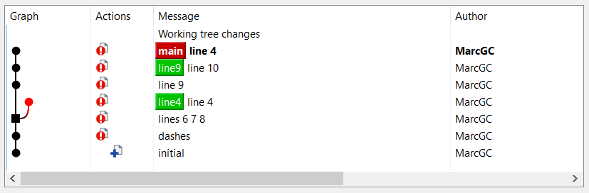

---

<!-- _class: invert -->

# get fit at git<!-- fit -->

### hands-on git beginners training

- curated & distilled know-how
- with exercises, best practices & tips
- direct feedback

Marc Gonzalez-Carnicer `gomr@betterask.erni`


---

# what is git?<!-- fit -->

The world's most used VCS. Conceived by Linus Torvalds, who lacked a tool to manage the linux kernel contributions.

Very powerful & efficient, though not very intuitive for beginners. Therefore, without the proper knowledge & practice it __can be dangerous__.


---

# is git dangerous?<!-- fit -->

[ __recent__ online ad ]

Apparently, people can lose valuable code not only with _raw git_, but also using _git protection wrappers_ such as github.


---

# introduction

This training:

* is about _getting fit at git_ (__not__ a complete reference)
* contains _tips_ & _best practices_
* requires you to do exercises (too easy?)
* covers the very basics (too obvious?) and fundamentals
* some contents and exercises may be skipped (depending on your previous knowledge): let the trainer know
* it's long (too much information?) - you may do / read it at home

---

### custom training 

In order to better customize this training, tell us about:

* your experience with git (and other VCSs)
* what you can do with git
* what you don't feel comfortable with
* your expectations for this training

---

<!-- _class: invert -->

# basic concepts<!-- fit -->

## (quick review)

---

## repository

Where _everything_ is stored. There are 2 types of repositories:

* regular: contains both _files_ & _history_
* bare: only the _history_ (the contents of the `.git` folder)

# distributed

* git is a distributed VCS, it can be used off-line
* clones (repository copies) contain __ALL__ the history
* (unlike in a centralized VCS like svn)

---

# git log (history)

The log is the repo history. It is a graph formed of nodes + lines.

* graph nodes (commits) : are diffs / patches / deltas
* graph lines (between nodes) : define ancestry (parent)

Tips:

* strictly speaking, the arrow direction in git graphs indicate the parent (not the time or progress)
* even if you follow the simple _no-branches_ branching strategy, you still need to use and __visualize__ the log.

---

# git graph

See the nodes, as well as the arrows pointing to the parent node.

 find the merge node

---

# patch / diff

Algebraically, a node (diff / delta / patch) is defined as:

`[ contents of commit2 ]` - `[ contents of commit1 ]`

`patch` and `diff` are the _conceptual base_ beneath git. They are linux commands since prehistoric times.


---

# what is a patch?

A patch is the substraction of 2 (text) file sets. Therefore, like files, it is composed of lines. Both _negative_ (removed) and _positive_ (added).


Patches also contain information about files.

---

# branch

The most important concept in _modern_ VCSs.

The main reason why git was created is because in svn (the mainstream VCS at the time), the branching (& merge) mechanism is poorly designed (although it was _good enough_ for that time). Merging with svn beyond very simple use cases is tough and complicated.

---

# branching vs git branch

A _git branch_ does __not__ imply a _bifurcation_, as in a tree.

In git, branching (bifurcation) is allowed thanks to _git branches_.

 Humans think of branches as the ones in a tree.

---

# branching vs git branch

A _git branch_ is a _label_ or _reference_ that points to a commit.

 Here we see 3 _git branches_ and only 2 _bifurcations_.


---

# branching without branch

Branching happens as soon as a file is modified. Regardless of using git or any other VCS, or without explicitly creating branches:

1. different users, _same branch_
1. same user, different repos, _same branch_

```
int a = 0;           int a = 0;    |  <=   int a = 0;
int b = 3;  <= ! =>  int b = 4;    |  <=   int b = 1;
```


---

# no branch no commits

Commits without a _git branch_ are deleted / lost. Therefore:

* ensure your valuable commits have a branch (or reference)
* delete a branch to get rid of useless commits

Reminder: git was designed to being able of removing _unused work_.

Downside: beginners (or not so beginners) may lose _valuable work_.

---

<!-- _class: invert -->

# configure your git<!-- fit -->

### get ready to work with git

---

# download the tools

For this training, the chosen tools in windows are _tortoise git_ (old, svn-themed client for windows) and kdiff3 (old, simple but efficient). Feel free to suggest or use better tools (no support guaranteed).

1. download and install kdiff3: https://download.kde.org/stable/kdiff3/

1. download and install tortoise git: https://tortoisegit.org/download/

1. with tortoise git, clone the _git helper tools repo_: https://github.com/carnicer/gitTools

---

## CLI or GUI?

This is a recurrent debate: what is best, using a GUI or the CLI?

* a __minimum proficiency__ of the CLI (Command Line Interface) will always be necessary
* a __hybrid method__ is indeed _best_: choose what you do with one or another, depending on your preferences and your GUI tool

---

# configure tortoise git

configure tortoise git bash (`vi ~/.bashrc`) with the git aliases and prompt. Edit `bashrc.bash`, leave only the `bash_aliases` and `git_aliases` entries.

- configure the diff tool: `C:\Program Files\KDiff3\kdiff3.exe`
- configure the merge tool: `C:\Program Files\KDiff3\kdiff3.exe %base %mine %theirs -o %merged`

---

# configure your (CLI) ID

Who are you?

* `git config [--global] user.name "your name"`
* `git config [--global] user.email your@email.com`

The optional `--global` option is for specifying which ID to configure: for that repo, or for all repos (default).

---

# configure the CLI

Configure the `git lol` __git-alias__ (see & copy from `git_aliases.sh`), your favorite CLI editor ...

* `git config --global --add alias.lol "log --graph --decorate --pretty=oneline --abbrev-commit --all"`
* set the `EDITOR` environment variable, like i.e.:`export EDITOR='vim -X'`
* if using linux, configure your `.bashrc` with alias files (like the ones provided in this training)

---

# configure the files to ignore

For each one of your repos, configure the files to ignore by editting `.gitignore` at the top of your repo. It contains entries such as:

* `output.html` : generated files, to be kept out of git
* `build/output/` : build folders
* `*.o` : typical for C/C++ if no build folder
* `*.swp` : if you use vim

In github there are convenient ready-to-use _ignore templates_, offered when a repo is created.

---

# configure the CLI git prompt

The CLI _git prompt_ is __very useful__, even required. With it (unlike with some GUIs), you can always know _where_ and _how_ you are:

- view your current branch name
- view your current operation status (are you clean?)


In some tools like _git bash for windows_ it is already configured. If not, _source_ the appropiate bash files as explained in _configure the CLI_.

---

<!-- _class: invert -->

# master the log <!-- fit -->

---

# use & understand the log

Identify in a git graph (refer to previous slide with graph or to upcoming _exercise #1_):

- the nodes (commits)
- the connections
- the parents and the children.
- the merge commits

Not using the graph log view with branches is like typing with half eye instead of 2. This feature is a bit hidden in github (_insights_ / _network_).

---

# GUI log

With _tortoise git_, have always open a _show log_ and a _check for modifications_ windows.

With the CLI, use `git lol` and its aliases (provided and suggested by this training). Type `alias | grep git lo` to see them.

---

## use your HEAD: avoid HASH

Many git operations require specifying at least a commit as parameter.

Commits are identified by a _unique_ HASH (SHA-1), a long hexadecimal number, like `9fe67124046504220c94924a459eeba00b009abd`, which may be abbreviated as `9fe6712`.

Commit hashes are computed from the commit diff, the author, date, and several other data.

---

### the HEAD

The `HEAD` refers to the __commit__ where the currently _checked-out branch_ is pointing to.

* tip : refer to commits using relative `HEAD` positions, instead of HASH (hard to memorize and type)
* examples: `HEAD~6`, `HEAD~2`, `HEAD~1` (= `HEAD~`), `HEAD^1`, `HEAD^2`
* references to other branch names (local or remote) may also be used instead (i.e. `github/feature12`)

----

<!-- _class: invert -->

# exercise #1

### log and diff<!-- fit -->

---

# exercise #1

This exercise is about using the _git log graph_ to see history and diffs, between commits and between branches

#### grab a repo

Clone the demo repo:

https://github.com/ERNI-Academy/training-dumb-repo/

For this exercise, you can also clone or use your favorite git repo.


---

# git log with the GUI

Using the GUI :

* identify the branches
* view commit diffs
* compare diffs between 2 commits
* view diffs between branches
* checkout to different branches

---

# git log with the CLI

Using the CLI:

* use `git log`
* use `git lol`
* use `git lol -9`
* use `git show` on a given commit

---

# diffs with the CLI

* view diffs between 2 commits, practice diff reference formats: `HEAD~2`, `..HEAD~2`, `..branch`, `branch2..commit1`, ...
* use also `git difftool` (complicated with _git bash for windows_)
* use `git diff --name-status` between 2 commits to see __only__ the changed files (screen not flooded)
* checkout to different branches

---

<!-- _class: invert -->

# basic commands<!-- fit -->

---

# basic commands (1)

Is there any one of these commands you don't know? Just ask.

* `git clone` (once per repo)
* `git init` (once per repo)
* `git checkout`
* `git branch`
* `git add`
* `git commit`
* `git status`


---

# basic commands (2)

Is there any one of these commands you don't know? Just ask.

* `git show`
* `git diff`
* `git reset`
* `git merge`
* `git rebase`
* _fast-forward_ (both with `merge`/`rebase`)

---

# merge vs rebase

Merge & rebase are different ways of _integrating_ 2 git branches together:

* merge (__into__) : __creates__ a _new merge commit_
* rebase : __moves__ the commits __onto__ a _new base_
* both cmds have a _direction_
* produce same output (files)


---

<!-- _class: invert -->

## integration example<!-- fit -->

---

# integration example

Integration: process of bringing changes together.

In the following example the basic _git integration commands_ (`checkout`, `reset`, `merge`, `rebase` ...) are used.

In the exercise, you will have to replicate this example.

__IMPORTANT__: You _don't have to remember_, but instead _understand_ what is being done.

---

### initial situation

* 3 branches: _main_ (`HEAD`), _line4_, _line9_
* 2 bifurcations


---

### hard reset

* checkout _main_ branch
* reset (hard) of _main_ branch __to__ _line4_ branch


---

### merge

* right-click on _line9_
* select _Merge_
* _line9_ branch is merged __into__ _main_ branch


---

### go back with a reset

Now with rebase. First, let's get back to the previous situation.

* select branch _line4_
* reset (_main_ branch) __to__ _line4_ branch
* notice: the tool _remembers_ the branch-less merge commit


---

### rebase (with backup)

* add a _backup branch_ to avoid _forgetting_ the merge
* _main_ branch is rebased __onto__ _line9_ branch
* _line4_ branch is _not forgotten_ by now (it has a reference)


---

### compare the merge and rebase commits

* select both commits (merge + rebase)
* right click on _compare revisions_
* verify they are identical

 Yes, they are identical!


---

### delete merge branch

Delete the _merge branch_. Fear not, it is not necessary anymore.



---

### delete rebased old branch

Delete the already rebased _line4 branch_ too. Remember: git was designed to be able to _delete_ unvaluable work.


---

### fast-forward merge/rebase

Proper use of _fast forward_: checkout _line9_, merge/rebase with FF.


---

### force a no-ff (fast-forward) merge

Force a _no fast-forward_ merge with `--no-ff` (checkbox).


---

<!-- _class: invert -->

# exercise #2

# integration commands<!-- fit -->

---

# exercise #2: integration commands

Replicate the examples in the previous section :

1. with tortoise git
1. with the CLI


---

<!-- _class: invert -->

# best practices / tips #1

# the stash is your friend<!-- fit -->

---

# the stash

The _stash_ (or _index_) are the changes that are marked (_staged_) for committing.

This means you can _play_ with which subset of your current changes you want to commit, for a nicer and more meaningful history.

---

# the stash cycle

The picture says it all.

 all? how about _unstaging_?

---

# partial commits

Select _hunks_ (partial diffs) with either:

* diff viewer, then click _merge_
* `git add --patch` / restore after commit / editor
* `git add <file>` instead of `git add -uno`

---

# unstaging

For _unstaging_ (remove from index/stash), you can either :

- `git restore <file> # modern style`
- `git checkout -- <file> # old style`

NOTE: _tortoise git_ eliminates the stash (considers modified files as staged without an explicit add)

Question for linux fans: Notice the awkward syntax above. What does the '--' stand for?)

---

<!-- _class: invert -->

# exercise #3

# stashing / partial add<!-- fit -->

---

# exercise #3A

With a diff viewer (kdiff3), select the changes to commit and the changes to discard (this is the _cherry picking_ concept):

1. edit 1 file in 3 locations, 1 with _bad_ changes
1. view changes with kdiff3, discard wrong ones (_merge_)
1. add the 2 _good_ sections with 2 separate commits


---

# exercise #3B

Now using raw CLI:

1. edit 1 file in 3 locations, 1 with _bad_ changes
1. use `git add --patch` to add/discard
1. add the 2 _good_ sections with 2 separate commits


---

# use raw diff & patch [optional]

It is also possible to select changes _the old way_, with `git diff` (or `git format-patch`), then `git am` or `git apply`.

That's how the _linux kernel_ was developed when the project was sacked from a commercial VCSs for license infringement. That led Linus Torvalds to implement git.

Many svn teams still (have to) use the _patch technique_ for sharing and reviewing their work.

Not covered in this training.

---

<!-- _class: invert -->

# best practices / tips #2

## check your wallet<!-- fit -->

---

# ensure no errors were made

After a merge / rebase / interactive rebase, __ALWAYS__ :

* check that changes are identical or correct: `git diff --name-status <before> [<after>]`
* if unsure, then use regular `git diff` (or a git GUI)
* more about this on _best practices, tips #4_ (_keep your work safe_)


---

# set the upstream

Set the branch _upstream_ to avoid specifying the target/source on each command:

`git branch --set-upstream # or -u`

The _upstream_ : __default__ branch where to merge, rebase, push to or pull from. See also the concept of _tracking branch_.


---

<!-- _class: invert -->

# changing history<!-- fit -->

---


# go back in time

Ever regretted a commit title, too many commits, etc? 

Nevermind, __you can change history__ :

* `git commit --amend`
* `git reset [--hard] HEAD~` (be careful!)
* also possible using the GUI
* but the killer tool is ...

---

# interactive rebase

The most powerful (and fun!) git tool :

`git rebase --interactive`

Allows you to do this with your commits :

* reword
* reorder
* join
* split / change

---

## CLI guided menu (self-documented)

```
pick d1b17a3c6b fix the bug
pick d93d254929 create ChildrenClass::getData method
pick a2b1c037f9 remove typo when fixing the bug

# Rebase f03867c185..a2b1c037f9 onto f03867c185 (3 commands)
#
# Commands:
# p, pick <commit> = use commit
# r, reword <commit> = use commit, but edit the commit message
# e, edit <commit> = use commit, but stop for amending
# s, squash <commit> = use commit, but meld into previous commit
# f, fixup [-C | -c] <commit> = like "squash" but keep only the previous
# ...
# These lines can be re-ordered; they are executed from top to bottom.
#
# If you remove a line here THAT COMMIT WILL BE LOST.
#
# However, if you remove everything, the rebase will be aborted.
```

---

# interactive rebase

* GUI: select commit from where you want to rebase, then tick the _force rebase_ checkbox
* CLI: select _from where_ to change with `HEAD~<n>`.

tips:

* with the CLI, use `git reset HEAD~` to edit the commit contents
* when rebasing many commits, don't do them all at once (simplify)
* do backups of your latest _good_ branch

---

<!-- _class: invert -->

# exercise #4

# interactive rebase<!-- fit -->

---

# exercise #4

With the _dumbRepo_ repo, experiment with reordering, rewording, squashing ...

* with the tortoise git GUI (_rebase_ option, then _force rebase_ checkbox)
* with the CLI: `git rebase --interactive <from commit>`

---

# exercise #4

What to do in case of error / too many merge conflicts:

* force impossible reordering
* force merge conflicts

You may have to use `git rebase --abort`.

---

<!-- _class: invert -->

# best practices / tips #3

## git golden rule<!-- fit -->

---

# git golden rule: never force push

When collaborating, and your work has already been shared, don't cause trouble to your colleagues. They may have started their work after yours.

Therefore, __never__ `push --force` already pushed branches (modified afterwards). Even if you just changed a title. Well, _never never ..._

---

### alternatives

If you feel the urge to upload your _drafty_ changes to the server (for safety, review, experimental sharing), and you know these will be heavily modified / tuned __afterwards__, try one of these:

* create a branch with a clearly _drafty_ name (i.e. _joeJunk_)
* if using github, create a draft PR and clearly state in the description that it is experimental (use at your own risk)
* publish the branch in an unofficial / private mirror

---

<!-- _class: invert -->

# conflict solving<!-- fit -->

---

# how to solve merge conflicts (CLI)

CLI:

* `git mergetool <file>` (`git status` to find out which file)
* fix the conflicts (there's no recipe for that)
* `git add` on the CLI
* if in trouble, do `git reset --hard HEAD` / `git merge --abort`

---

# how to solve merge conflicts (GUI)

GUI:

* open the conflicted file with kdiff3 (_Edit conflicts_)
* fix the conflicts (there's no recipe for that)
* click _resolved_ on the _tortoise git_ GUI (as in SVN)

### tips to fix merge conflicts

Some tips when merging files after a merge conflict:

* ...
* ...

---

<!-- _class: invert -->

# exercise #5

# fix a merge conflict<!-- fit -->

---

# create a merge conflict

Cause a merge conflict by:

* create 2 branches (or 2 people work in the same branch, then push/pull)
* edit the same line with different content
* commit, then merge / commit + push, fetch (2 people)

---

# fix it

* with the GUI
* with the CLI

---

<!-- _class: invert -->

# best practices / tips #4

## avoid merge conflicts<!-- fit -->

---

# conflict solving

Conflict solving is not a git-exclusive _feature_, many other VCSs require to do it too. It may be a painful experience.

It can become so painful, that some _branching strategies_ authors (gurus) recommend one or another with the sole objective of minimizing them.

This section presents tips to avoid or minimize merge conflicts.

---

# the zero-conflict trick

 do you do this?


---

## merge conflicts types

Types of merge conflicts:

- simple textual conflict
- painful textual conflict: many changes, impossible to process with diff viewers
- semantic conflict: It _may not be detected_, because sometimes it builds!): It is _very dangerous_. Example: copy + rename method, other developer adds call to old method name

---

## how to reduce merge conflicts

Reduce conflict occurrences and complexity by:

- enforce style before reviewing changes, so later on colleagues don't feel tempted to make unrelated changes fixing them
- write tidy code: EOL whitespace, indentation, TAB/blanks consistency
- don't fix other colleagues unrelated changes => do that on a specific commit / also like for reducing code smells with tools like sonarqube

---

## social tips to reduce conflicts (1)

Reduce conflict occurrences and their complexity by:

- commit / publish first the smallest / simplest change (less probability of hard to solve merge conflicts)
- the _zero conflicts trick_ should be intentionally avoided at all costs, may cause conflict panic
- high-tech & revolutionary trick: use your soft skills and communicate (__TALK!__): before the commit, but also before starting to develop the change

---

## social tips to reduce conflicts (2)

- use peer review to keep colleagues informed on what you have done (not only for reviewing the code)
- use agile meetings to inform / get informed about possible conflicts
- use the proper branching pattern accordingly

---

## don't let branches diverge

Branches diverge exponentially with time, not linearly 


Branch divergence and therefore, conflict complexity, can be tackled following the social tips.

---

<!-- _class: invert -->

# remotes<!-- fit -->

---

# remotes

A remote is a _clone_ of the repo you are working with. Or, your repo may be a clone of another repo.

It may be in the same disk, in the same computer, in another computer, or in the cloud (i.e. github).

With git, teams can choose which _remote configuration_ they want to use. Let's see:

---

# centralized configuration

The way most teams using git with github work: like svn teams.

 sharing only through a central repo

---

# distributed configuration

A non-centralized way of working. Each repo can be assigned a different role or to a person. There can be many possibilities, i.e. combining with a centralized _master repo_ too.

 share independently between repos

---

# git vs github

git is not github / github is not git

github is a cloud service with fancy collaboration features like the famous _pull request_, which is a merge with a review + approve process.

From the point of view of your local repo, in github you simply store a remote repo.

Note: this is not a github configuration course: keys, permissions, etc.

---

# set up your own 'github'

You don't need github (or similar) to use git and __share your work__. You can have your own remotes, or your colleagues can let you use them.

Just setup a shared remote mirror (`git clone --mirror`) with a generic linux user.

Faster, no network downtime, etc (if located in the local network). But no fancy features.

---

# operations with remotes

Most common operations with remotes:

* `add` (only once), `remove` , `rename`
* `fetch` : receive colleagues changes from the remote
* `push` : publish changes (to colleagues or publicly)
* `pull` : `fetch` + __automatic__ merge/rebase

tip: __don't use__ `git pull` (or at least be careful). It's dangerous, your HEAD will be modified automatically. Better do `fetch`, then `merge`/`rebase` after inspection.

---

<!-- _class: invert -->

# more integration commands<!-- fit -->

---

# more integration commands

Other useful _integration_ git commands:

* `cherry-pick`: pick a commit, without merge/rebase

* `revert` : undo a commit with another one (a _negative_ cherry-pick)

* => cherry-pick : a _negative_ revert

---

# git reset

Discover the 3 `git reset` options with the exercise:

- hard reset
- mixed reset
- soft reset (like `git update-ref`)

The difference between options has to do on how the _stash_ and the files are left: modified, added, etc.

---

<!-- _class: invert -->

# exercise #6

# cherry-pick, revert, reset<!-- fit -->

---

# exercise #6 : cherry-pick, revert

* revert the last commit, revert it again.
* check differences.
* instead of reverting again, with a new branch (in the first revert), cherry-pick the _original_ last commit.
* check differences.
* do it with the CLI too.

---

# exercise #6b : reset

With the CLI (not with tortoise), do:

* make a _backup branch_: `git branch backup` (don't checkout it!)
* `git reset --soft HEAD~`
* check what happened
* `git reset --hard backup`
* `git reset HEAD~ # like --mixed`
* check what happened
* `git reset --hard backup`

---

# exercise #6c : revert + squash

When performing an _interactive rebase_, it is possible to do _magic_ with history combining `revert` + `squash`, just following the algebraic principle of:

> A + B + C = (A + B) + C = A + (B + C)

Not covered in this training.

---


<!-- _class: invert -->

# best practices / tips #5

# merge vs rebase + cleanup

---

# merge vs rebase

The holy war question: merge or rebase, what is best?

My personal take:

* if simple (few branches with nearby origin) : __MERGE__
* if reintegrating (from the mainline): __REBASE__
* other cases? depends
* you can always rewrite history (before _publishing_!)

---

# get rid of useless stuff

* delete your old branches, both local and remote

* don't fetch/pull everything, just get what you need (otherwise you may get dozens of github PRs)

* use `git prune` and the `git gc` (garbage collector) to get rid of unused references

* `git update-ref`: save time updating branches and don't modify your files (to avoid rebuilding them)


---

<!-- _class: invert -->

# best practices / tips #6

## keep your work safe<!-- fit -->

---

# keep your work safe

Simple tips to avoid losing your work when integrating:

* before a risky operation, create a new _backup branch_, named like i.e. _beforeMerging_ (don't check it out)
* have a mirror repository. Push there often, and specially before integrating / doing risky operations
* push to the corporate repo (this may not be allowed)

Remember: unlike svn, git was designed to destroy useless work.

---

<!-- _class: invert -->

# exercise #7

# backup your work<!-- fit -->

---

# exercise #7A: backup branches

* create _a backup branch_
* intentionally, damage everything (interactive rebase, reset, pull, merge, ...)
* recover damage with a simple `reset --hard` to the _backup branch_

---

# exercise #7B: local mirror

* create a local mirror, push to it:
  `git clone --mirror ... # once`
  `git remote add <remote name> <local url>`
  `git push --all <remote name>`

---

# exercise #7C : create a remote mirror

For enhanced safety (different HD), create a remote mirror (linux machine only):

On the remote machine:

1. `git init --bare` : once

On the local machine:

2. `git remote add <remote name> <remote url>` : once
3. `git push --all <remote name>` : as much as required

---

<!-- _class: invert -->

# best practices / tips #7

## disaster recovery<!-- fit -->

---

# disaster recovery

I messed it up. My work is lost. Can I get it back?

* did you do a branch before resetting?
* did you make a backup in a remote?

If the answer to both questions is __NO__, then perhaps the `git reflog` command may help.

Not covered in this training.

---

<!-- _class: invert -->

# best practices / tips #8

## for svn users<!-- fit -->

---

# commit vs publish

In SVN, a commit publishes your changes - in git NOT, and you can _change history_

Quote by Seth Robertson:

> Commit Often, Perfect Later, Publish Once


---

# git vs svn

The git UI (its commands) do not have a reputation for being intuitive (Linus Torvalds didn't care). Same actions, different names:

- `git clone` / `svn checkout`
- `git checkout` / `svn switch`
- `git pull --rebase` / `svn update`
- `git commit` / `svn diff >/tmp/mySafepoint1.patch`
- `git checkout --` / `svn revert!`
- `git push` / `svn commit`
- `git revert --` / `svn merge '-'` + `svn commit`
- ...

---

# simplified git UIs

Confused with the git CLI complexity? You may try

https://gitless.com/ (not covered in this training).

TFS and other GUIs also offer a simplified _user interface_.

The drawback is that the user is not really aware of what happens beneath the commands.

---

<!-- _class: invert -->

# homework<!-- fit -->

---

# homework

Don't forget what you have just learned today (lots of information). Practice. Again. Read. Try. Retry. It will pay off: __get fit at git !__

* repeat the exercises
* do this hands-on online tutorial: https://learngitbranching.js.org/ __absolutely recommended!__
* read books and tutorials:
  - [Pro git book](https://git-scm.com/book/en/v2) by Scott Chacon & Ben Straub
  - [bitbucket tutorials](https://www.atlassian.com/git/tutorials) by atlassian

---

# how do you feel?<!-- fit -->


Are you still scared and insecure?


---

# that's it!<!-- fit -->

# any questions?<!-- fit -->
<!-- _class: invert -->

---


